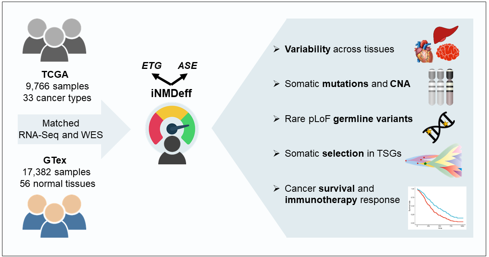

# Individual NMD efficiency (iNMDeff)

Repository to reproduce analysis, figures and tables of the research article titled "_Variable efficiency of nonsense-mediated mRNA decay across human tissues, tumors and individuals_"

  

## Quantification of iNMDeff

To estimate  individual NMD efficiency (iNMDeff), we employed Bayesian generalized linear models, fitting a negative binomial distribution using `Stan`. This modeling was implemented via the `stan_glm` function from the `rstanarm` R package, with `family = neg_binomial_2` specified as the parameter.

### Endogenous Target Gene (ETG) iNMDeff method

For the ETG method, a *Negative binomial GLM with log link* model is applied, pooling all transcripts together within a sample, for each of the 11 NMD gene sets (includes the negative control) separately, as follows:

$$\text{RawTranscriptExp} \sim \text{NegBin}(\mu, \theta)$$

$$\log(\mu) = \beta_0 + \beta_1 \cdot \text{NMDtarget} + \beta_2 \cdot \text{geneID} + \beta_3 \cdot \text{transcriptLength}$$

| Term                   | Description                                                                                                                         |
|------------------------|-------------------------------------------------------------------------------------------------------------------------------------|
| **RawTranscriptExp** | Raw read counts for each transcript (one row per transcript). |
| **NMDtarget**         | Binary indicator: `1` = transcript is predicted to be an NMD target; `0` = control of the matched pair. |
| **geneID**            | ENSEMBL gene identifier.  Included as a categorical covariate to account for between-gene variability. |
| **transcriptLength**  | Total length of the transcript (sum of exon lengths, in bp).  Controls for the bias that longer transcripts accumulate more reads. |

By comparing each NMD target transcript against its paired control from the same gene, we establish an internal control. This approach effectively accounts for potential confounders affecting trans-gene expression levels. For instance, CNAs or transcription factors might alter the expression of one transcript without affecting the other. Such discrepancies are particularly pertinent if comparing transcripts across different genes. Although we already exclude genes overlapping with CNAs, this internal control further ensures the robustness of our analysis against such confounding factors.

### Allele-Specific Expression (ASE) iNMDeff method

For the ASE method, the model is applied, pooling all PTCs together within a sample, for each of the 3 NMD variant sets (includes the negative control) separately, as follows:

Raw_variant_allele_counts ~ NMD_target + gene_id

Where:
-Raw_variant_allele_counts: represents the allele specific expression raw counts of the germline PTC.
-NMD_target : indicates whether the allele is MUT (1), thus, NMD target, or WT (0), thus, control, within the selected pair.
-gene_id : is the ENSEMBL gene ID included to adjust for between-gene differences.

In both NMD methods, the coefficient assigned to the ‘NMD_target’ variable serves as our estimate of iNMDeff for a specific NMD variant or gene set, as well as its corresponding negative control. We reversed the direction of the raw coefficient values, so that now higher coefficients indicate greater iNMDeff, and lower coefficients indicate reduced efficiency. The final interpretation is that it is a negative log (base e) ratio of the raw expression levels of the NMD target transcripts (ETG) or MUT alleles (ASE) divided by the control transcripts (ETG) or WT alleles (ASE). For a more intuitive interpretation, one could exponentiate the coefficient to derive the ratio between NMD targets and controls. In this context, ratios above 1 would suggest lower NMD efficiency, while ratios below 1 would indicate higher NMD efficiency. It is important to note that for our analysis, we utilized the original log coefficients rather than these exponentiated ratios.

## Repository structure

1. [01_generate_input](https://github.com/gpalou4/iNMDeff/tree/main/01_generate_input) --> Generates all input data required for the **individual NMD efficiency (iNMDeff)** estimation and downstream analysis.

    - [01_TCGA_RNAseq_quantification](https://github.com/gpalou4/iNMDeff/tree/main/01_generate_input/01_TCGA_RNAseq_quantification) --> Nextflow pipelines for 1) RNA-seq gene/transcript-level quantification and 2) allele-specific expression (ASE) variant calling. It includes _fastq_ alignment to human genome with _STAR_, transcriptomic quantification using _RSEM_ or allele-specific expression (ASE) variant calling for germline variants using _Strelka2_ across all ~10k samples from the TCGA cohort.
    - [02_VCF_variant_annotation](https://github.com/gpalou4/iNMDeff/tree/main/01_generate_input/02_VCF_variant_annotation) --> Variant annotation using _ANNOVAR_, for GTex and TCGA germline _VCF_ files.
    - [03_NMD_gene_sets](https://github.com/gpalou4/iNMDeff/tree/main/01_generate_input/03_NMD_gene_sets) -->
        1) Checks for NMD-triggering/evading features across the v88 ENSEMBL _gtf_ annotation file: uORFs at 5'UTR and GC content at 3'UTR.
        2) Obtains NMD gene sets, from different sourced articles.
        3) Updates gene symbols to the same current version.
        4) For each NMD gene set generated above, creates different new features for the ENSEMBL transcripts (#ORFs and length, transcript length, RNA-seq TPM expression, MANE transcript) and classifies transcripts as NMD-target or controls (non NMD-target) for each gene.
        5) Chooses the best NMD-target and control transcripts for every gene across all our NMD gene sets.
    - [04_individual_NMD_efficiency](https://github.com/gpalou4/iNMDeff/tree/main/01_generate_input/04_individual_NMD_efficiency)
        1) [PTC_NMD_rules](https://github.com/gpalou4/iNMDeff/tree/main/01_generate_input/04_individual_NMD_efficiency/PTC_NMD_rules). Classifies premature termination codons (PTCs, from nonsense and indel mutations) as NMD-triggering or NMD-evading based on canonical known genomic NMD rules. Done for GTex and TCGA individuals separately. For indels, the position of the downstream generated PTC is firstly predicted.
        2) Estimates **individual NMD efficiency (iNMDeff)** separately for [**ASE**](https://github.com/gpalou4/iNMDeff/tree/main/01_generate_input/04_individual_NMD_efficiency/ASE) and [**endogenous target gene (ETG)**](https://github.com/gpalou4/iNMDeff/tree/main/01_generate_input/04_individual_NMD_efficiency/endogenous_target_gene) methods (and separately for every NMD gene set).
           
2. [02_analysis](https://github.com/gpalou4/iNMDeff/tree/main/02_analysis) --> Main analysis are iNMDeff variability and associations with genetic mutations, CNAs, survival and immunotherapy response.
    - [01_iNMDeff_robustness](https://github.com/gpalou4/iNMDeff/tree/main/02_analysis/01_iNMDeff_robustness) --> Assess robustness of ETG and ASE iNMDeff methods by different orthogonal approaches: cell lines with UPF1 KD, PRO-seq data, ASE-ETG correlations, comparison with tissue rankings from Teran et. al. (GTex only), etc.
    - [02_iNMDeff_variability](https://github.com/gpalou4/iNMDeff/tree/main/02_analysis/02_iNMDeff_variability):
       1) Randomization tests for iNMDeff variability: Inter-Tissue iNMDeff variability deviation (ITNVD) test and Tissue iNMDeff Deviation (TND)
       2) Plot for ITNVD test
       3) General linear model (glm) to predict iNMDeff and assess variability explained by the different explanatory variables such as CNA, cancer or tissue type, sex, tumor purity, etc.
       4) Inter-individual iNMDeff variability tests
    - [03_iNMDeff_associations](https://github.com/gpalou4/iNMDeff/tree/main/02_analysis/03_iNMDeff_associations) --> Associations between ETG/ASE iNMDeff and genetic alterations, survival and immunotherapy response.
       1) Cell type deconvolution in brain (proportion of glia vs neuron cells)
       2) Rare variant association analysis (RVAS) of putative loss-of-function (pLoF) germline variants across all protein coding genes. This was done using SKAT-O, separately for ETG and ASE iNMDeff, for 18 matched GTex tissues and TCGA cancer types, and 3 pLoF datasets: i) One threshold involved only NMD-triggering PTC variants, and the other two additionally included the predicted deleterious missense variants using CADD scores at two different cutoffs: >= 25 (more stringent) and >= 15 (permissive).
       3) Immune infiltration analysis from TCGA and Hartwig cohorts for CD8+ cytotoxic T-cells
       4) Immunotherapy response associations for external cohorts from different cancer types. Includes survival analysis for OS and PFS, and immunotherapy response prediction by logistic regression.
       5) Somatic CNA associations (TCGA only). Firstly, [sparse-PCA](https://github.com/gpalou4/iNMDeff/tree/main/02_analysis/03_iNMDeff_associations/somatic_CNAs/01_sparse_PCA_CNA) is used to obtain pan-cancer CNA principal component signatures (CNA-PCs). Secondly, associations between 86 CNA-PCs and ETG/ASE iNMDeff are found [here](https://github.com/gpalou4/iNMDeff/tree/main/02_analysis/03_iNMDeff_associations/somatic_CNAs/02_CNA_PCs_associations), with its downstream analysis to pinpoint the underlying nature of significant CNA-PCs and its potential causal genes (fine-mapping analysis).
       6) Somatic mutations associations (TCGA only) affecting 112 NMD-related genes + ~750 known cancer genes at pan-cancer level and by cancer type.
       7) Somatic selection analysis (TCGA only) via dN/dS method (dNdScv) of known cancer genes, with a focus in NMD-triggering PTCs affecting TSGs and stratifying patients between High and Low iNMDeff.
       8) Survival analysis for OS and PFS (TCGA only) for untreated patients, and chemotherapy or immunotherapy treated patients separately for different cancer types, stratifying patients between High and Low iNMDeff. Includes Kaplan-Meier curves and Cox proportional hazard models.
    - [build_iNMDeff_efficiency_proxy_models](https://github.com/gpalou4/iNMDeff/tree/main/02_analysis/build_iNMDeff_efficiency_proxy_models) --> Proxy models for predicting iNMDeff based on RNA-seq gene expression data. LASSO and Ridge models were trained and validated for either GTex or TCGA cohorts. These models were used for validations in cell lines or to assess iNMDeff in external cohorts where no transcript-level expression data was available.

3. [03_figures_and_tables](https://github.com/gpalou4/iNMDeff/tree/main/03_figures_and_tables) --> Scripts to reproduce main figures, supplementary figures and tables from the output generated in [02_analysis](https://github.com/gpalou4/iNMDeff/tree/main/02_analysis)

## Contact

For inquiries or issues please contact directly at `guillepalou4@gmail.com`

